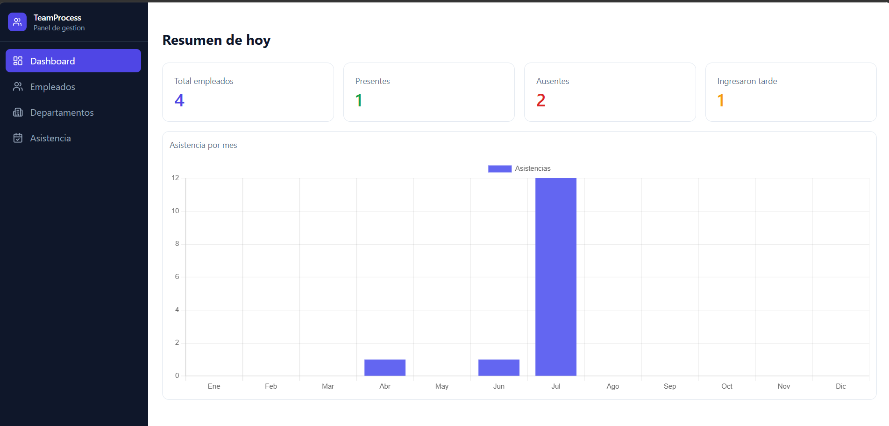
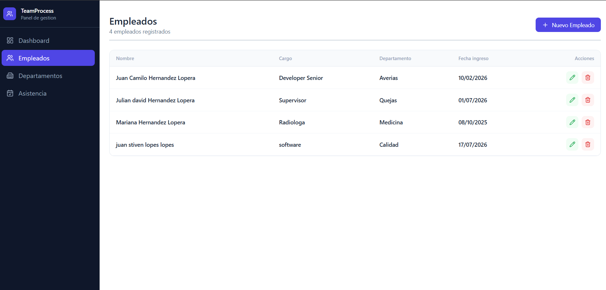
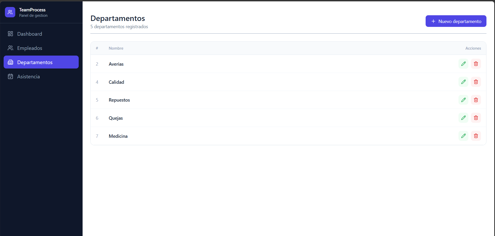
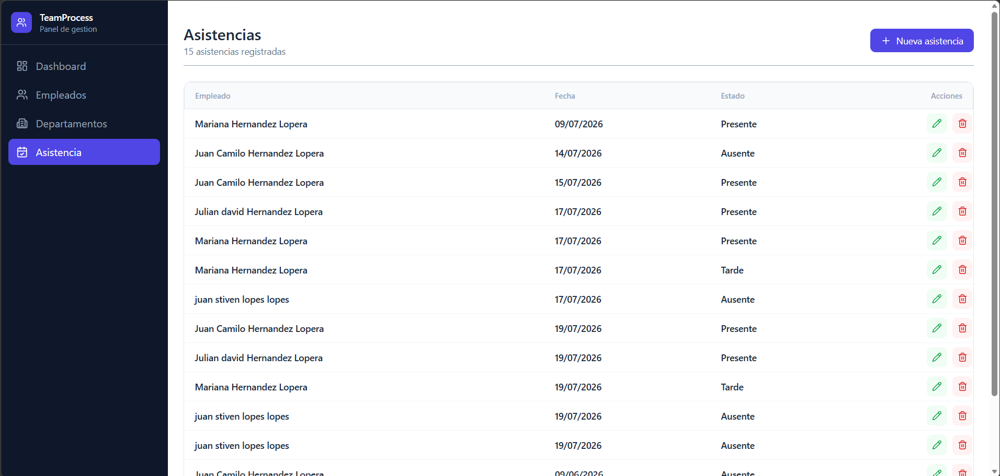

# TeamProcess
 
Sistema de gestión de empleados y asistencia con dashboard de métricas en tiempo real.
 

 
---
 
## Stack tecnológico
 
**Backend**
- ASP.NET Core Web API (.NET 10)
- Entity Framework Core + SQL Server
- FluentValidation
- Scalar (OpenAPI)
**Frontend**
- Angular 21 + TypeScript
- Tailwind CSS
- Chart.js
- Lucide Angular (iconos)
---
 
## Características
 
- Gestión de departamentos (CRUD)
- Gestión de empleados con asignación por departamento (CRUD)
- Registro de asistencia diaria con estados: Presente, Ausente, Tarde (CRUD)
- Dashboard con KPIs del día: total empleados, presentes, ausentes, tardanzas
- Gráfica de barras de asistencia por mes
---
 
## Capturas
 
### Dashboard

 
### Empleados

 
### Departamentos

 
### Asistencia

 
---
 
## Cómo correrlo localmente
 
### Requisitos previos
- .NET 10 SDK
- SQL Server
- Node.js 18+
- Angular CLI
### Backend
 
```bash
# Clonar el repositorio
git clone https://github.com/tu-usuario/team-process.git
cd team-process/TeamProcess.API
 
# Configurar la cadena de conexión en appsettings.json
"ConnectionStrings": {
  "DefaultConnection": "Server=localhost\\SQLEXPRESS;Database=TeamProcess;Trusted_Connection=True;TrustServerCertificate=true"
}
 
# Aplicar migraciones
dotnet ef database update
 
# Correr el backend
dotnet run
```
 
El backend corre en `https://localhost:7227`
 
### Frontend
 
```bash
cd team-process/team-process-app
 
# Instalar dependencias
npm install
 
# Correr el frontend
ng serve
```
 
El frontend corre en `http://localhost:4200`
 
---
 
## Estructura del proyecto
 
```
team-process/
├── TeamProcess.API/          # Backend ASP.NET Core
│   ├── Controllers/          # Endpoints de la API
│   ├── Data/                 # AppDbContext
│   ├── DTOs/                 # Request y Response DTOs
│   ├── Extensions/           # ServiceExtensions
│   ├── Models/               # Entidades
│   ├── Services/             # Lógica de negocio
│   └── Validators/           # FluentValidation
│
└── team-process-app/         # Frontend Angular
    └── src/app/
        ├── core/
        │   ├── models/       # Interfaces TypeScript
        │   └── services/     # Servicios HTTP
        └── features/
            ├── dashboard/    # Dashboard con KPIs y gráfica
            ├── departments/  # CRUD departamentos
            ├── employees/    # CRUD empleados
            └── attendances/  # CRUD asistencia
```
 
---
 
## Desarrollado por
 
**Camilo Hernández** — Desarrollador Full Stack  
[GitHub](https://github.com/tu-usuario) · [LinkedIn](https://linkedin.com/in/tu-usuario)
